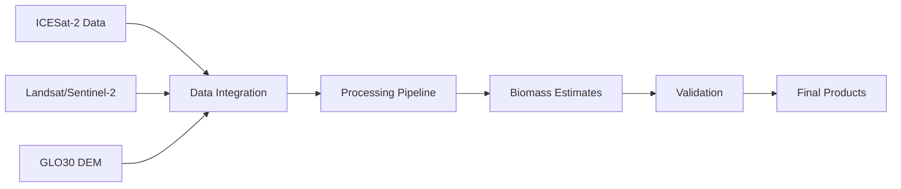

# About ICESat-2 Boreal Forest Biomass Mapping

## Overview

The ICESat-2 Boreal Forest Biomass Mapping project represents a groundbreaking initiative to map and monitor the vast boreal forests using advanced satellite technology. By combining data from NASA's ICESat-2 satellite with Landsat/Sentinel-2 imagery and the Copernicus GLO30 Digital Elevation Model, we're creating unprecedented insights into one of Earth's most crucial ecosystems.

## Mission

Our mission is to advance understanding of boreal forest dynamics and their role in the global carbon cycle through:
- Precise biomass estimation
- Long-term forest monitoring
- Climate change impact assessment
- Support for evidence-based policy decisions

## Key Technologies

### Satellite Systems
- **ICESat-2/ATLAS**: Advanced Topographic Laser Altimeter System
- **Landsat/Sentinel-2**: Multi-spectral imaging satellites
- **Copernicus GLO30**: High-resolution digital elevation model

### Processing Pipeline


## Impact Areas

### Climate Science
- Carbon stock assessment
- Ecosystem monitoring
- Climate change research
- Greenhouse gas modeling

### Forest Management
- Resource inventory
- Change detection
- Conservation planning
- Sustainable forestry

### Policy Support
- International agreements
- Conservation strategies
- Resource management
- Climate action plans

## Research Focus

### Current Research Priorities
1. Improving biomass estimation accuracy
2. Enhancing temporal resolution
3. Reducing uncertainty
4. Developing new algorithms

### Innovation Areas
- Machine learning applications
- Uncertainty quantification
- Multi-sensor fusion
- Time series analysis

## Project Team

### Leadership
| Name | Role | Affiliation |
|------|------|-------------|
| Laura Duncanson | Principal Investigator | University of Maryland |
| Paul Montesano | Co-Investigator | NASA GSFC |
| Nathan Thomas | Co-Investigator | Edge Hill University |

### Key Contributors
- Remote sensing specialists
- Forest ecologists
- Data scientists
- Software engineers
- GIS experts

## Funding and Support

### Primary Funding
- NASA Arctic Boreal Vulnerability Experiment (ABoVE)
- Multi-Mission Algorithm and Analysis Platform (MAAP)

### Supporting Organizations
- University of Maryland
- NASA Goddard Space Flight Center
- Edge Hill University
- DevelopmentSeed, Inc.

## Technical Capabilities

### Data Processing
- High-performance computing
- Cloud-based processing
- Automated workflows
- Quality control systems

### Analysis Tools
- Custom algorithms
- Statistical modeling
- Machine learning
- Visualization tools

## Applications

### Scientific Research
```python
# Example biomass calculation
def calculate_biomass(height, density):
    """
    Calculate forest biomass using allometric equations
    """
    return model.estimate(height, density)
```

### Policy Support
- Carbon credit validation
- Forest management planning
- Conservation assessment
- International reporting

## Future Directions

### Short-term Goals (1-2 years)
- [ ] Enhanced resolution products
- [ ] Improved uncertainty estimates
- [ ] New validation methods
- [ ] Extended coverage areas

### Long-term Vision (3-5 years)
- [ ] Global forest monitoring
- [ ] Real-time change detection
- [ ] Advanced ML integration
- [ ] Enhanced prediction models

## Get Involved

### For Scientists
- Access our datasets
- Contribute algorithms
- Validate results
- Collaborate on research

### For Developers
- Contribute to codebase
- Improve documentation
- Develop new features
- Fix bugs

### For Users
- Download products
- Provide feedback
- Share use cases
- Join community

## Resources

### Documentation
- [Technical Guides](docs/technical/)
- [API Reference](docs/api/)
- [User Manuals](docs/users/)
- [Tutorials](docs/tutorials/)

### Community
- [GitHub Repository](https://github.com/nasa/icesat2_boreal)
- [Discussion Forum](https://github.com/nasa/icesat2_boreal/discussions)
- [Slack Channel](https://icesat2-boreal.slack.com)
- [Mailing List](mailto:icesat2-boreal@lists.nasa.gov)

## Publications

### Key Papers
1. "Global Patterns of Boreal Forest Biomass"
2. "ICESat-2 Forest Measurement Validation"
3. "Machine Learning in Forest Remote Sensing"

### Conference Presentations
- AGU Fall Meeting 2024
- ForestSAT 2024
- ESA Living Planet Symposium 2024

## Contact

### General Inquiries
- Email: info@icesat2-boreal.org
- Phone: +1 (xxx) xxx-xxxx
- Address: [Institution Address]

### Technical Support
- Support: support@icesat2-boreal.org
- Documentation: docs@icesat2-boreal.org
- Development: dev@icesat2-boreal.org

---

*Last Updated: November 2024*

[Website](https://icesat2-boreal.org) | [GitHub](https://github.com/nasa/icesat2_boreal) | [Documentation](https://docs.icesat2-boreal.org)