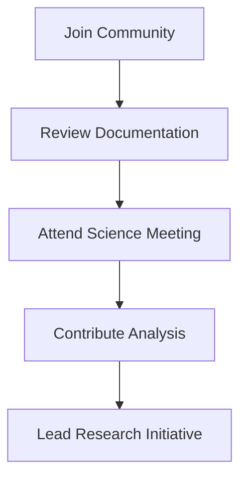
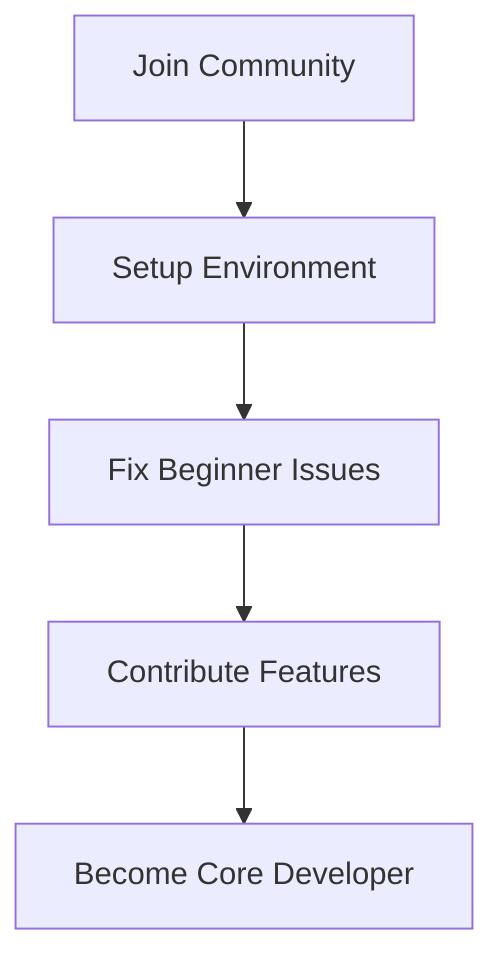

# Join the ICESat-2 Boreal Forest Project

<!--  -->

## 🌟 Why Join Us?

Welcome to the ICESat-2 Boreal Forest Biomass Mapping project! We're a collaborative community working to revolutionize our understanding of Earth's boreal forests through advanced satellite technology and data science.

## 🎯 Project Impact

Our work directly contributes to:
- Climate change research
- Forest conservation efforts
- Carbon cycle understanding
- Environmental policy making
- Global ecosystem monitoring

## 👥 Who We're Looking For

### Scientists and Researchers
- Remote sensing specialists
- Forest ecologists
- Climate scientists
- Data scientists
- Geospatial analysts

### Developers and Engineers
- Python developers
- Machine learning engineers
- GIS specialists
- Cloud computing experts
- DevOps engineers

### Domain Experts
- Forestry professionals
- Environmental scientists
- Policy analysts
- Science communicators
- Project managers

## 🌱 Getting Started

### 1. Join Our Communication Channels
- [Slack Workspace](https://icesat2-boreal.slack.com)
- [Mailing List](mailto:icesat2-boreal-subscribe@lists.nasa.gov)
- [GitHub Discussions](https://github.com/nasa/icesat2_boreal/discussions)

### 2. Attend Community Events
- **Monthly Updates**: First Thursday, 2 PM EST
- **Technical Workshops**: Bi-monthly
- **Code Sprints**: Quarterly
- **Annual Symposium**: September each year

### 3. Find Your Path

#### For Scientists


#### For Developers


## 🎓 Learning Resources

### Beginner Resources
- [Project Overview](docs/overview.md)
- [Technical Documentation](docs/technical.md)
- [Tutorial Videos](https://youtube.com/icesat2boreal)
- [Sample Notebooks](notebooks/examples)

### Advanced Materials
- [Algorithm Documentation](docs/algorithms.md)
- [API Reference](docs/api.md)
- [Research Papers](docs/publications.md)
- [Technical Workshops](docs/workshops.md)

## 🤝 Mentorship Program

We offer a structured mentorship program for new contributors:

1. **Onboarding**
   - Project orientation
   - Technical setup support
   - Community introduction

2. **Skill Development**
   - Guided contributions
   - Code reviews
   - Regular feedback

3. **Project Advancement**
   - Research opportunities
   - Publication involvement
   - Leadership roles

## 🏆 Recognition and Benefits

### Professional Development
- Co-authorship opportunities
- Conference presentations
- Skill workshops
- Networking events

### Project Recognition
- Contributor highlights
- Publication credits
- Community awards
- Project leadership opportunities

## 📅 Upcoming Events

| Event | Date | Location | Description |
|-------|------|-----------|------------|
| New Contributor Workshop | Monthly | Virtual | Introduction to project tools and workflows |
| Code Sprint | Quarterly | Virtual | Focused development on specific features |
| Science Meeting | Bi-weekly | Virtual | Research updates and discussions |
| Annual Symposium | September | In-person/Hybrid | Project showcase and planning |

## 🌍 Global Community

Our community spans:
- 20+ Countries
- 50+ Research Institutions
- 100+ Active Contributors
- Multiple Time Zones

## 📬 Contact Information

### Project Leadership
- **Principal Investigator**: Laura Duncanson (lduncans@umd.edu)
- **Technical Lead**: [Name] (email@institution.edu)
- **Community Manager**: [Name] (email@institution.edu)

### Support Channels
- Technical Support: support@icesat2-boreal.org
- Community Help: community@icesat2-boreal.org
- General Inquiries: info@icesat2-boreal.org

## 🔄 Next Steps

1. **Join Communication Channels**
   ```bash
   # Get started with our Slack
   Visit: icesat2-boreal.slack.com/signup
   ```

2. **Set Up Development Environment**
   ```bash
   git clone https://github.com/nasa/icesat2_boreal.git
   cd icesat2_boreal
   python -m venv venv
   source venv/bin/activate
   pip install -r requirements.txt
   ```

3. **Find First Task**
   - Check [good first issues](https://github.com/nasa/icesat2_boreal/labels/good%20first%20issue)
   - Review [contribution guide](CONTRIBUTING.md)
   - Attend next community call

## 🤔 FAQ

**Q: Do I need specific expertise to contribute?**
A: We welcome contributors at all levels and provide mentorship and support.

**Q: How much time commitment is expected?**
A: Contribution levels are flexible and can range from occasional to regular involvement.

**Q: Can I contribute remotely?**
A: Yes! Most of our collaboration is remote-friendly and asynchronous.

## 📜 Code of Conduct

We maintain a welcoming, inclusive community. Please review our [Code of Conduct](CODE_OF_CONDUCT.md) before participating.

---

*Join us in advancing Earth science through open collaboration and innovation!*

[Join Our Slack](https://icesat2-boreal.slack.com) | [View on GitHub](https://github.com/nasa/icesat2_boreal) | [Project Website](https://icesat2-boreal.nasa.gov)