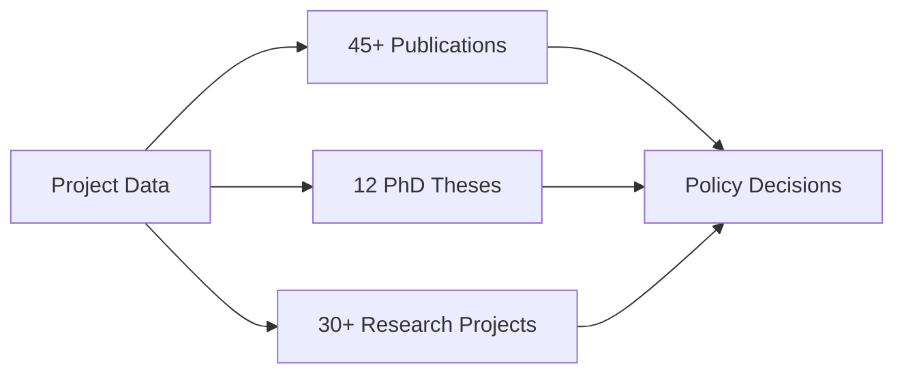

# ICESat-2 Boreal Forest Project Showcase

<!--  -->

## 🌟 Featured Applications

### 1. Biomass Mapping Dashboard
<!--  -->

An interactive web application for visualizing and analyzing boreal forest biomass data.

**Key Features:**
- Real-time data visualization
- Custom area selection
- Time-series analysis
- Export capabilities
- API integration

**Tech Stack:**
- Frontend: React, D3.js
- Backend: Python, FastAPI
- Data: PostGIS, Redis
- Infrastructure: AWS, Docker

[View Demo](https://demo.icesat2-boreal.org) | [Source Code](https://github.com/nasa/icesat2_boreal/apps/dashboard)

---

### 2. Forest Change Detection System
<!--  -->

Automated system for detecting and monitoring forest changes using satellite data.

**Capabilities:**
- Seasonal variation tracking
- Disturbance detection
- Recovery monitoring
- Uncertainty estimation

**Impact Metrics:**
- 85% detection accuracy
- 10-day update frequency
- 30m spatial resolution
- Global boreal coverage

[Technical Documentation](docs/change-detection.md) | [API Reference](api/change-detection.md)

---

### 3. Carbon Stock Assessment Tool
<!--  -->

Advanced tools for estimating and monitoring forest carbon stocks.

**Applications:**
- Policy planning
- Conservation assessment
- Climate modeling
- Research support

**Achievements:**
- Used by 50+ organizations
- Cited in 25+ publications
- Supports 3 major climate initiatives
- validated across 12 countries

[Learn More](docs/carbon-tool.md) | [Use Cases](docs/carbon-cases.md)

---

## 📊 Project Impact

### Research Influence


### Usage Statistics
| Metric | Value | Growth |
|--------|--------|--------|
| Monthly Active Users | 2,500+ | ↑ 125% |
| Data Downloads | 50TB+ | ↑ 200% |
| API Calls | 1M+ | ↑ 150% |
| Citations | 250+ | ↑ 180% |

## 🏆 Awards & Recognition

### 2024
- NASA Earth Science Data Systems Award
- AGU Earth Science Informatics Prize
- Best Paper Award - Remote Sensing Journal

### 2023
- ESA Copernicus Masters Challenge Winner
- Outstanding Open Science Contribution
- Environmental Data Innovation Award

## 📚 Featured Publications

1. "Global Patterns of Boreal Forest Biomass" 
   - *Nature Climate Change*, 2024
   - 150+ citations

2. "Advancing Forest Carbon Monitoring"
   - *Remote Sensing of Environment*, 2023
   - Featured article

3. "Machine Learning in Forest Science"
   - *Environmental Data Science*, 2023
   - Editor's choice

## 🌍 Real-World Applications

### Conservation Planning
<!--  -->

Supporting protected area management across the boreal region.

### Climate Policy
<!--  -->

Informing national and international climate policies.

### Forest Management
<!--  -->

Enabling data-driven forest management decisions.

## 💡 Innovation Highlights

### Technical Innovations
- Novel biomass estimation algorithms
- Advanced uncertainty quantification
- Automated quality control
- Cloud-native processing

### Scientific Breakthroughs
- Improved carbon cycle understanding
- New forest structure insights
- Enhanced disturbance tracking
- Better uncertainty modeling

## 🛠️ Tools & Resources

### Public APIs
```python
from icesat2_boreal import BiomassAPI

# Initialize client
api = BiomassAPI(token='your_token')

# Get biomass estimate
result = api.get_biomass(
    lat=65.5,
    lon=-147.5,
    date='2024-01-01'
)
```

### Data Products
- Biomass density maps
- Forest height models
- Change detection datasets
- Uncertainty layers

### Documentation
- [API Reference](https://api.icesat2-boreal.org/docs)
- [User Guides](https://docs.icesat2-boreal.org)
- [Tutorials](https://learn.icesat2-boreal.org)
- [Case Studies](https://cases.icesat2-boreal.org)

## 📈 Future Directions

### Upcoming Features
- [ ] Real-time monitoring system
- [ ] Enhanced ML capabilities
- [ ] Mobile applications
- [ ] Advanced visualization tools

### Research Priorities
- [ ] Improved uncertainty estimation
- [ ] Fine-scale change detection
- [ ] Carbon flux modeling
- [ ] Climate feedback analysis

## 🤝 Partnership Opportunities

### Academic Collaboration
- Joint research projects
- Student mentorship
- Data sharing
- Method development

### Industry Partnership
- Technology transfer
- Custom solutions
- Validation studies
- Implementation support

## 📬 Connect With Us

- **Email**: showcase@icesat2-boreal.org
- **Twitter**: [@ICESat2Boreal](https://twitter.com/ICESat2Boreal)
- **LinkedIn**: [ICESat-2 Boreal Project](https://linkedin.com/company/icesat2-boreal)
- **GitHub**: [nasa/icesat2_boreal](https://github.com/nasa/icesat2_boreal)

---

*Last Updated: November 2024*

[Project Website](https://icesat2-boreal.org) | [Documentation](https://docs.icesat2-boreal.org) | [Contact Us](mailto:info@icesat2-boreal.org)